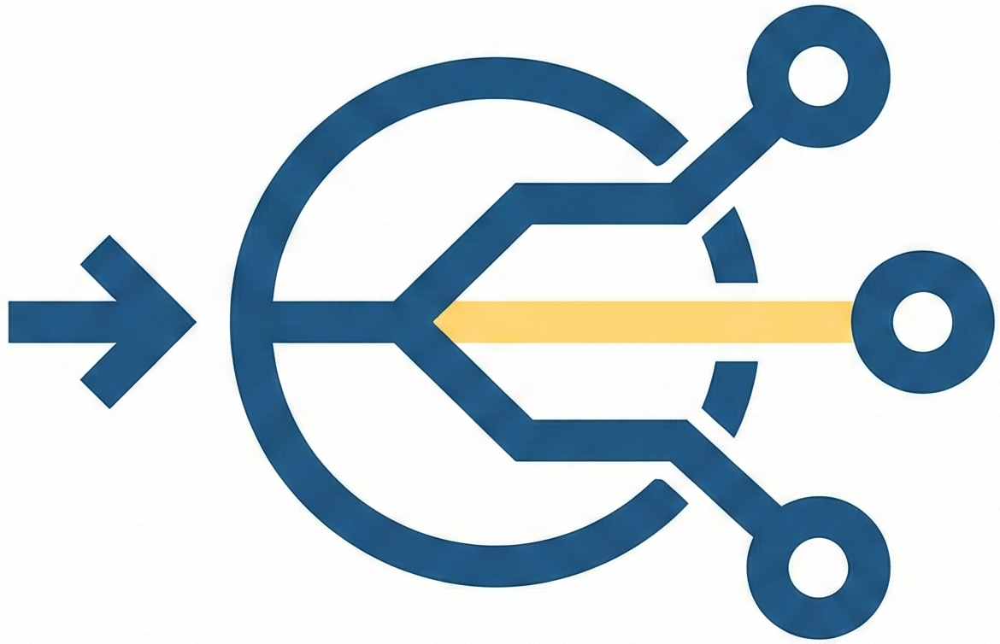
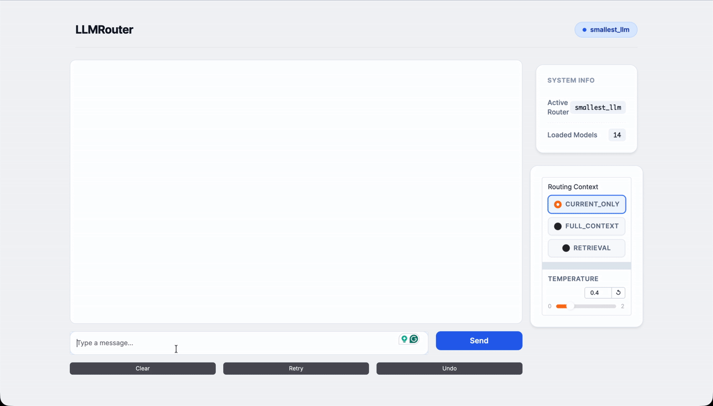

<div align="center">
  
</div>


<h1 align="center">🚀 LLMRouter: An Open-Source Library for LLM Routing</h1>

<p align="center">
  <a href="https://www.python.org/downloads/release/python-3109/">
    
  </a>
  <a href="https://github.com/ulab-uiuc/LLMRouter/pulls">
    
  </a>
  <a href="https://join.slack.com/t/llmrouteropen-ri04588/shared_invite/zt-3jz3cc6d1-ncwKEHvvWe0OczHx7K5c0g">
    
  </a>
  <a href="https://github.com/ulab-uiuc/LLMRouter/blob/main/LICENSE">
    
  </a>
</p>


## Introduction ✨

<div style="text-align:center;">
    
</div>

**LLMRouter** is an intelligent routing system designed to optimize LLM inference by dynamically selecting the most suitable model for each query. To achieve intelligent routing, it defines:

- 🚀 **Smart Routing**: Automatically routes queries to the optimal LLM based on task complexity, cost, and performance requirements.
- 📊 **Multiple Router Models**: Support for **over 16 routing models**, including KNN, SVM, MLP, Matrix Factorization, Elo Rating, Graph-based routers, BERT-based routers, Hybrid probabilistic routers, transformed-score routers, multi-round routers, and many additional advanced strategies.
- 🛠️ **Unified CLI**: Complete command-line interface for training, inference, and interactive chat with Gradio-based UI.
- 📈 **Data Generation Pipeline**: Complete pipeline for generating training data from 11 benchmark datasets with automatic API calling and evaluation.


## News 📰

- 🚀 **[2025-12]**: **LLMRouter** is officially released - ship smarter 🧠, cost-aware 💸 LLM routing with 16+ routers 🧭, a unified `llmrouter` CLI 🛠️, and a plugin workflow for custom routers 🧩.


## Quick Navigation 🔗

| Section | Description |
|---------|-------------|
| [Get Started](#get-started-) | Installation and quick setup guide |
| [Supported Routers](#supported-routers-) | Full list of 16+ routers with documentation |
| [Tutorials](tutorials/index.md) | Jupyter notebook tutorials for each router |
| [API Reference](api/index.md) | Complete API documentation |


## Supported Routers 🧭

### Single-Round Routers
| Router | Training | Inference | Description |
|--------|:--------:|:---------:|-------------|
| KNN Router | ✅ | ✅ | K-Nearest Neighbors based routing |
| SVM Router | ✅ | ✅ | Support Vector Machine based routing |
| MLP Router | ✅ | ✅ | Multi-Layer Perceptron based routing |
| MF Router | ✅ | ✅ | Matrix Factorization based routing |
| Elo Router | N/A | ✅ | Elo Rating based routing |
| DC Router | ✅ | ✅ | Dual Contrastive learning based routing |
| AutoMix | N/A | ✅ | Automatic model mixing |
| HybridLLM | ✅ | ✅ | Hybrid LLM routing strategy |
| Graph Router | ✅ | ✅ | Graph-based routing |
| CausalLM Router | ✅ | ✅ | Causal Language Model router |

### Multi-Round Routers
| Router | Training | Inference | Description |
|--------|:--------:|:---------:|-------------|
| Router-R1 | [External](https://github.com/ulab-uiuc/Router-R1) | ✅ | RL-based multi-round routing with reasoning |

### Personalized Routers
| Router | Training | Inference | Description |
|--------|:--------:|:---------:|-------------|
| GMT Router | ✅ | ✅ | Graph-based personalized router with user preference learning |

### Agentic Routers
| Router | Training | Inference | Description |
|--------|:--------:|:---------:|-------------|
| KNN Multi-Round | ✅ | ✅ | KNN-based agentic router for complex tasks |
| LLM Multi-Round | N/A | ✅ | LLM-based agentic router for complex tasks |

See the [full router documentation](api/routers.md) for detailed usage.


## Get Started 🚀

### Installation

=== "From Source (Recommended)"

    ```bash
    # Clone the repository
    git clone https://github.com/ulab-uiuc/LLMRouter.git
    cd LLMRouter

    # Create and activate virtual environment
    conda create -n llmrouter python=3.10
    conda activate llmrouter

    # Install the package
    pip install -e .
    ```

=== "From PyPI"

    ```bash
    pip install llmrouter-lib
    ```

### Setting Up API Keys 🔑

LLMRouter requires API keys to make LLM API calls for inference, chat, and data generation. Set the `API_KEYS` environment variable:

=== "JSON Array (Recommended)"

    ```bash
    export API_KEYS='["your-key-1", "your-key-2", "your-key-3"]'
    ```

=== "Comma-Separated"

    ```bash
    export API_KEYS='key1,key2,key3'
    ```

=== "Single Key"

    ```bash
    export API_KEYS='your-api-key'
    ```

!!! note "Important"
    - API keys are used for **inference**, **chat interface**, and **data generation**
    - Multiple keys enable automatic load balancing across API calls
    - For persistent setup, add the export command to `~/.bashrc` or `~/.zshrc`

### Configuring API Endpoints 🌐

API endpoints can be specified at two levels (resolved in priority order):

| Priority | Location | Description |
|:--------:|----------|-------------|
| 1 | Per-Model | `api_endpoint` field in LLM candidate JSON (`default_llm.json`) |
| 2 | Router-Level | `api_endpoint` field in router YAML config |

??? example "Per-Model Endpoints (default_llm.json)"
    ```json
    {
      "qwen2.5-7b-instruct": {
        "model": "qwen/qwen2.5-7b-instruct",
        "api_endpoint": "https://integrate.api.nvidia.com/v1"
      },
      "custom-model": {
        "model": "custom/model-name",
        "api_endpoint": "https://api.customprovider.com/v1"
      }
    }
    ```

??? example "Router-Level Endpoint (YAML config)"
    ```yaml
    api_endpoint: 'https://integrate.api.nvidia.com/v1'  # Fallback for all models
    ```

### Quick Test

```bash
# Route a single query (no API calls needed)
llmrouter infer --router knnrouter \
  --config configs/model_config_test/knnrouter.yaml \
  --query "What is machine learning?" \
  --route-only
```


## Interactive Chat Demo 💬

<div style="text-align:center;">
    
</div>

Launch the Gradio-based chat interface:

```bash
llmrouter chat --router knnrouter --config configs/model_config_test/knnrouter.yaml
```


## Extending with Custom Routers 🧩

LLMRouter supports a plugin system so you can add custom routers under `custom_routers/` and use them via the same CLI without modifying core code.

??? example "Minimal Custom Router Example"
    ```python
    from llmrouter.models.meta_router import MetaRouter
    import torch.nn as nn

    class MyRouter(MetaRouter):
        def __init__(self, yaml_path: str):
            super().__init__(model=nn.Identity(), yaml_path=yaml_path)

        def route_single(self, query_input: dict) -> dict:
            return {"model_name": "your_model_name"}

        def route_batch(self, batch: list) -> list:
            return [self.route_single(x) for x in batch]
    ```


## Citation 📚

If you find LLMRouter useful for your research or projects, please cite:

```bibtex
@misc{llmrouter2025,
  title        = {LLMRouter: An Open-Source Library for LLM Routing},
  author       = {Tao Feng and Haozhen Zhang and Zijie Lei and Haodong Yue and Chongshan Lin and Jiaxuan You},
  year         = {2025},
  howpublished = {\url{https://github.com/ulab-uiuc/LLMRouter}},
  note         = {GitHub repository}
}
```


## Acknowledgments 🙏

LLMRouter is built upon the research of the following papers:

| Router | Paper | Venue |
|--------|-------|-------|
| RouteLLM | [RouteLLM: Learning to Route LLMs with Preference Data](https://arxiv.org/abs/2406.18665) | NeurIPS 2024 Workshop |
| Hybrid LLM | [Hybrid LLM: Cost-Efficient and Quality-Aware Query Routing](https://arxiv.org/abs/2404.14618) | ICLR 2024 |
| RouterDC | [RouterDC: Query-Based Router by Dual Contrastive Learning](https://arxiv.org/abs/2409.19383) | Findings of EMNLP 2024 |
| GraphRouter | [GraphRouter: A Graph-based Router for LLM Selections](https://arxiv.org/abs/2410.03834) | NAACL 2025 |
| AutoMix | [AutoMix: Automatically Mixing Language Models](https://arxiv.org/abs/2310.12963) | NAACL 2025 |
| Router-R1 | [Router-R1: Teaching LLMs Multi-Round Routing via RL](https://arxiv.org/abs/2506.09033) | NeurIPS 2025 |
| GMT | [Generative Multi-Turn Routing](https://arxiv.org/abs/2506.14069) | arXiv 2025 |
