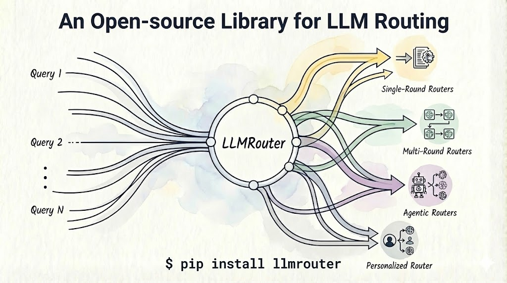

<div align="center">
  
</div>


<h1 align="center">LLMRouter<br>An Open-Source Library for LLM Routing</h1>


LLMRouter is an intelligent routing system designed to optimize LLM inference by dynamically selecting the most suitable model for each query based on task difficulty, cost, and performance requirements. It also provides a unified CLI for training, inference, and an interactive chat UI, plus a plugin system for custom routers.

<div style="text-align:center;">
    
</div>


## What you can do with LLMRouter
- Route each query to the best LLM (quality/cost/latency trade-offs)
- Train and compare classic ML, neural, and LLM-based routers
- Run single-query and batch inference (with optional API calls)
- Extend the system with custom routers via plugins (no core-code changes)

## Key capabilities
- Smart routing across 16+ router families, from lightweight baselines to multi-round strategies
- Unified CLI for training, batch inference, and chat UI
- Plugin system for custom routers without modifying core code
- Example configs and datasets for reproducible experiments

## Quickstart

Recommended for first-time users: clone the repo so you can use the example configs and datasets.

```bash
git clone https://github.com/ulab-uiuc/LLMRouter.git
cd LLMRouter

# Create a virtual environment (example with conda)
conda create -n llmrouter python=3.10
conda activate llmrouter

# Install
pip install -e .

# Route a single query (no API calls)
llmrouter infer --router knnrouter --config configs/model_config_test/knnrouter.yaml --query "What is machine learning?" --route-only
```

## Demo (chat UI)

<div style="text-align:center;">
    
</div>

```bash
llmrouter chat --router knnrouter --config configs/model_config_test/knnrouter.yaml
```

## Supported routers (overview)
LLMRouter supports a wide range of routing strategies:

- **Single-round routers**: KNN, SVM, MLP, MF, DCRouter, graph-based routers
- **Multi-round / agentic routers**: KNNMultiRoundRouter, LLMMultiRoundRouter, Router-R1
- **Personalized routers**: GMT-based routing with user preference signals
- **Baselines**: always-smallest / always-largest

See the full list (with per-router docs): [Routers](api/routers.md).

## Extending with custom routers
LLMRouter supports a plugin system so you can add a router under `custom_routers/` and use it via the same CLI.

??? example "Minimal custom router skeleton"
    ```python
    from llmrouter.models.meta_router import MetaRouter
    import torch.nn as nn

    class MyRouter(MetaRouter):
        def __init__(self, yaml_path: str):
            super().__init__(model=nn.Identity(), yaml_path=yaml_path)

        def route_single(self, query_input: dict) -> dict:
            return {"model_name": "your_model_name"}

        def route_batch(self, batch: list) -> list:
            return [self.route_single(x) for x in batch]
    ```

## Citation
If you find LLMRouter useful for your research or projects, please cite it as:

```bibtex
@misc{llmrouter2025,
  title        = {LLMRouter: An Open-Source Library for LLM Routing},
  author       = {Tao Feng and Haozhen Zhang and Zijie Lei and Haodong Yue and Chongshan Lin and Jiaxuan You},
  year         = {2025},
  howpublished = {\url{https://github.com/ulab-uiuc/LLMRouter}},
  note         = {GitHub repository}
}
```
